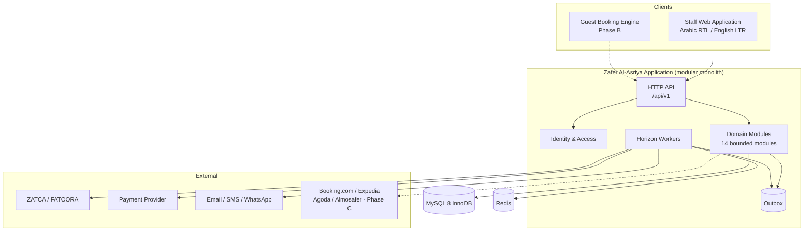

# Zafer Al-Asriya v1.0 — Architecture

| Field | Value |
|---|---|
| Document | `docs/ARCHITECTURE.md` |
| Version | 0.1 |
| Status | Draft — design specification. **Nothing is implemented.** |
| Related | `ADR-0001` … `ADR-0021`, `docs/DATA-MODEL.md`, `docs/API-SPEC.md`, `docs/STATE-MACHINES.md` |

---

## 1. Architectural stance

`Prd_Maker.md` §72: *"Do not add architecture merely because it is fashionable."* Microservices, Kubernetes, event sourcing, CQRS, service mesh, and multi-region active-active are **not** adopted, because no documented requirement justifies them.

The stance is a **modular monolith**: one deployable, one relational database, one team, clear module boundaries enforced at the code level. The decisive reason is not simplicity — it is **transactional integrity**. Atomic inventory allocation and atomic folio posting are single-database-transaction problems. Splitting them across services converts a local ACID guarantee into a distributed-consensus problem requiring sagas, compensating transactions, and a permanent consistency model. For a hotel that cannot sell the same room twice, that is the wrong trade at any scale.

## 2. System context



**The outbox is the only egress to any external system.** No module calls an external API inline.

## 3. Module boundaries

Fourteen modules, per `ADR-0017`: Identity/Access · Organization/Properties · Rooms/Inventory · Reservations · Guests · Front Desk · Housekeeping · Folio/Financials · Payments · Tax/ZATCA Compliance · Night Audit · CRS (B) · Channel Manager (C) · POS (C).

**Each module owns its tables.** Cross-module access goes through an explicit contract interface, never direct table access. A cross-module read that bypasses a contract is a reviewable defect.

### 3.1 The shared-transaction exception

Most cross-module interactions are async or use a local transaction. Exactly five operations commit across modules in **one** transaction, because the facts are not true independently:

| Operation | Modules | Why atomicity is required |
|---|---|---|
| Allocation → reservation confirm | Inventory + Reservations | An allocation without a reservation is unrecoverable ambiguity. **This is the double-booking guarantee.** |
| Reservation transition → folio open | Reservations + Folio | Checked in with no folio is a corrupt state |
| Charge posting → outbox row | Folio + outbox | Posting and downstream intent must not diverge |
| Payment → outbox row | Payments + outbox | Payment and reconciliation intent must not diverge |
| Invoice issue → outbox row | Tax + outbox | An unsubmitted invoice and a submission for a non-existent invoice are both unrecoverable |

The list is governed. A new atomic case requires an explicit amendment with justification — the friction is intentional.

## 4. Cross-cutting mechanisms

| Concern | Mechanism | ADR |
|---|---|---|
| External calls | Transactional outbox + Horizon | `ADR-0005` |
| Money | BCMath; exact `DECIMAL`; no float | `ADR-0006` |
| Concurrency | Transaction + row lock + unique constraint + rule + state validation + idempotency + test | `ADR-0008` |
| Authorization | Role + property scope + policy, server-side, deny by default | `ADR-0014` |
| Sensitive identity data | Fields only, separate key boundary, masking, access log | `ADR-0012` |
| Card data | Structurally absent from the schema | `ADR-0011` |
| Audit | Append-only, separation of duties | `ADR-0016` |
| Errors | Structured model, deterministic codes, `retryable` flag | `ADR-0019` |
| Direction (RTL/LTR) | CSS logical properties, runtime `dir` | `ADR-0015` |
| Period close | Resumable, idempotent, fail-stop batch | `ADR-0018` |

## 5. Request and command flow

```mermaid
sequenceDiagram
    participant C as Client
    participant A as API Layer
    participant S as Auth (Scope Check)
    participant M as Domain Module
    participant D as MySQL
    participant Q as Outbox
    participant W as Horizon Worker
    participant X as External

    C->>A: Request + Idempotency-Key + Correlation-ID
    A->>A: Validate schema; establish correlation ID
    A->>S: Identity + Role + Resource + Action + Scope + Policy
    S-->>A: Allow / DENY
    A->>M: Validated command
    M->>D: BEGIN TRANSACTION
    M->>D: Lock + validate + write business fact
    M->>Q: INSERT outbox row (same transaction)
    M->>D: Audit row (same transaction)
    M->>D: COMMIT
    M-->>A: Result (request state only)
    A-->>C: Response + correlation ID
    W->>Q: Poll
    W->>X: External call (bounded, idempotent)
    X-->>W: Result
    W->>D: Update submission state / DLQ / reconciliation
```

**The client is never told an external integration succeeded**, because the client is never waiting for one. This is the practical form of "never use UI state as proof of external success" (`Prd_Maker.md` §24).

## 6. Inventory concurrency

`ADR-0008` is normative. The summary that matters:

**MySQL row locking alone does not guarantee prevention of double booking.** The guarantee is the combination of: explicit short transaction · `SELECT ... FOR UPDATE` scoped to the stay with deterministic row ordering · a unique-constraint backstop · an explicit allocation rule · reservation state validation inside the transaction · client idempotency · **and the mandatory concurrency test**.

> Given one available sellable unit and two concurrent valid booking attempts, exactly one reaches `CONFIRMED`, the other receives `INVENTORY_UNAVAILABLE`, no duplicate confirmed allocation exists, and both attempts are traceable by correlation ID.

Availability **search** and availability **allocation** are deliberately different code paths. Search may read a replica and may be approximate; allocation always reads the primary and is exact. Conflating them is how overselling happens.

## 7. Financial architecture

Append-only ledger; corrections are compensating entries; the balance is derived from postings and never independently mutable; business date is stored separately from the creation timestamp; every invoice traces to its folio and postings (`ADR-0009`).

Phase A has exactly **two** posting paths — folio posting and night audit posting. POS room-charge posting is deferred to Phase C, which is a deliberate scope control, not an omission: it keeps a third posting path from competing for the same folio.

## 8. Compliance architecture

`ADR-0010`. The ZATCA compliance adapter and the payment provider adapter are **outbound ports** owned by their modules. The financial domain depends on the interfaces and never on a provider implementation or SDK type. This is what contains `B-02` and `B-04` to procurement and documentation problems rather than architectural ones.

Business state and compliance state are separate machines. A failed submission does not roll back a checkout; an unsubmitted invoice is visible and dead-lettered.

## 9. Frontend architecture

One Vue 3 + TypeScript + Tailwind application, one component set, one stylesheet, serving Arabic (RTL) and English (LTR) with runtime `dir` switching via CSS logical properties. No hard-coded direction assumptions, so a future Bengali LTR locale needs no component rewrite (`ADR-0015`). Direction correctness is treated as a correctness concern: a mirrored reservation grid produces booking errors, not cosmetic ones.

## 10. Observability and operations

Structured logs with correlation, request, actor, and integration IDs — **never secrets, never raw card data, never identity-document numbers**. Metrics for request count, latency, errors, queue depth, retry count, dead-letter depth, reconciliation backlog, integration success rate, database health, and resource saturation. Alerts carry threshold, severity, owner, escalation, and runbook.

**Stack `TBD` (`H-04`); no 24/7 support model exists yet (`H-05`).** No metric, threshold, or dashboard is claimed here because nothing has been deployed or measured.

## 11. Portability

The domain and application layers must not import provider SDK types (`D-007`). This keeps the provider decision (`B-03`) from propagating, and it is why the provider can be chosen after the domain is built. The infrastructure layer is provider-coupled and is where a future migration would cost real effort.

## 12. What is deliberately absent

| Not adopted | Why |
|---|---|
| Microservices | Would convert allocation and folio posting into distributed consensus. `ADR-0001` |
| Kubernetes | Not required by any documented requirement. `Prd_Maker.md` §72 |
| Event sourcing | An append-only ledger delivers the needed immutability at far lower cost. `ADR-0009` |
| CQRS / read models | Justified only by measured reporting load, which `B-05` has not established. Reconsiderable additively. |
| Service mesh | No service boundary to mesh. |
| Multi-region active-active | Would force cross-border PII replication, prohibited by `D-007`. |
| GraphQL | The requirement is a stable, cacheable, well-documented contract. May be added later as a read facade without changing the write contract. `ADR-0019` |
| Cache-first availability | Availability must be exact at allocation. `ADR-0008` |

Each of these is a **deferred or rejected** decision with a recorded reason, not an oversight.

## 13. Architecture risks

| Risk | Impact | Mitigation |
|---|---|---|
| Concurrency guarantee unproven because the test is skipped | **Critical** | Concurrency suite is a merge and release gate; removal test per case |
| Double booking from a control removed in refactor | **Critical** | Removal test; control checklist in review |
| An unknown payment outcome retried, causing a duplicate charge | **Critical** | `UNKNOWN_OUTCOME`; `retryable: false`; reconciliation only |
| Duplicate or gapped tax invoice on a resumed night audit | **Critical** | Resumable-not-restartable; controlled gapless sequence |
| Property breakout via an endpoint without a scope check | **Critical** | Single reusable scope path; mandatory test across all roles and 10 properties |
| Identity data leaking into logs | **Critical** | Automated log scan; redaction |
| Guest PII leaving Saudi Arabia | **Critical** | Replication default-off; transfer-assessment gate |
| Provider SDK types leaking into the financial domain | High | Outbound port ownership; dependency boundary |
| Module boundaries eroding | High | CI check for cross-module table access; governed atomic list |
| Requirements built on unverified regulatory assumptions | High | `UNKNOWN` marking; named owners; `BUS-016` |

## 14. Architectural readiness

The architecture is specified but **not verified**. It has not been built, not loaded, not tested, and not measured. Its strongest claims — the double-booking guarantee, the unknown-outcome payment path, the resumable night audit — are all claims about behaviour that **does not yet exist**.

The architecture is ready to be implemented. It is not ready to be trusted, and the difference is exactly what `ADR-0021` and the release gate in `docs/DEPLOYMENT.md` exist to close.
