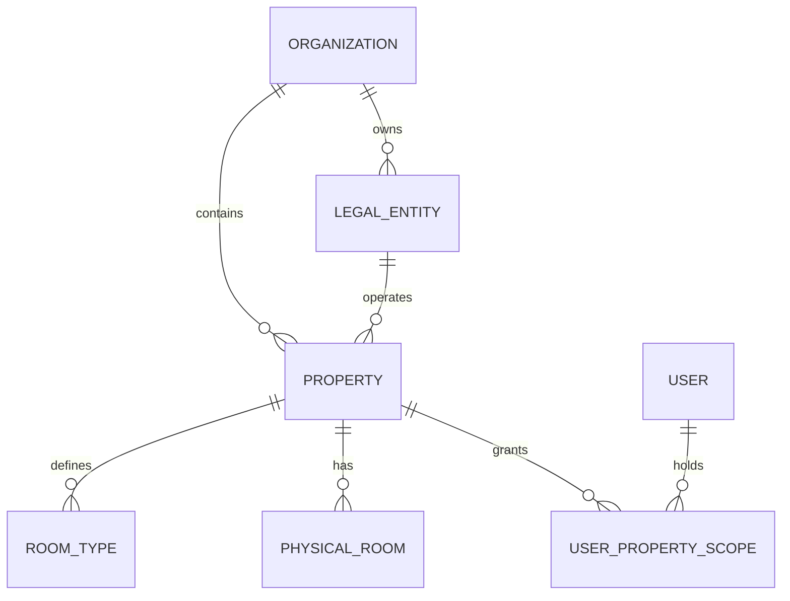

# Zafer Al-Asriya v1.0 — Data Model

| Field | Value |
|---|---|
| Document | `docs/DATA-MODEL.md` |
| Version | 0.1 |
| Status | Draft — logical design only. **No schema exists and no migration has been written.** |
| Database decision | MySQL 8.x, InnoDB (`D-006`, `ADR-0003`) |
| Related | `ADR-0003`, `ADR-0006`, `ADR-0007`, `ADR-0008`, `ADR-0009`, `ADR-0012`, `ADR-0016`, `ADR-0017`, `docs/STATE-MACHINES.md` |

---

## 0. Conventions and non-negotiables

| Rule | Requirement | Source |
|---|---|---|
| DM-1 | Primary keys are immutable internal surrogate identifiers. **Never** a phone number, email, name, or any mutable external reference. | `Prd_Maker.md` §17 |
| DM-2 | **No `FLOAT` or `DOUBLE` column type for any monetary value.** Exact `DECIMAL` with explicit precision and scale. Application-side arithmetic uses BCMath (`ADR-0006`). | `D-006`, `Prd_Maker.md` §17, §59 |
| DM-3 | Every monetary column carries an explicit **currency code**. No implicit group currency. | `Prd_Maker.md` §59 |
| DM-4 | Every table carries created-at, updated-at, and a concurrency version for optimistic checks. **Two stated exceptions**, both enumerated in `tests/Architecture/SchemaConventionTest.php`: an **append-only** table has no `updated_at` (it can never be updated, so the column is a contradiction) and carries no `lock_version`; and a **pure join table** carries no `lock_version` (a pivot row has no independent lifecycle to conflict over). | `ADR-0008`, `ADR-0016`, `ADR-0009` |
| DM-5 | Every property-scoped table carries `property_id` with a foreign key and an index leading with it. | `D-001` |
| DM-6 | Posted financial records are **append-only**. No `UPDATE`, no destructive `DELETE`. | `ADR-0009` |
| DM-7 | Timestamps are stored in one canonical representation (UTC) with an explicit `business_date` where a business date applies. Business date ≠ calendar date. | `ADR-0018`, `Prd_Maker.md` §58 |
| DM-8 | Identity-document data is encrypted at rest, masked by default, access-logged, and excluded from general logs and telemetry. | `D-004`, `ADR-0012` |
| DM-9 | Card data is **never stored**. Only provider-safe references. | `D-005`, `ADR-0011` |
| DM-10 | No table is created, and no task implementing one is started, without a `DR-` requirement ID in `docs/PRD.md` §15. | `Prd_Maker.md` §1.3 |

**Status of every entity below: `TBD` for physical details.** Names, lengths, and indexes are design proposals, not implemented decisions. The data migration and versioning rules of `Prd_Maker.md` §62 apply: backward compatibility, migration, backfill, cutover, validation, rollback, and deprecation date must be defined per change.

---

## 1. Tenancy and property isolation

`D-001`: single tenant, one organization (Zafer Al-Asriya), initially 10 properties, one deployment. No database-per-tenant, no schema-per-tenant, no SaaS multi-tenancy in v1.0.

### 1.1 Hierarchy

### 1.2 Future-SaaS safety without building multi-tenancy

`D-001` requires the core domain to remain extensible to future multi-tenancy **without rewriting the business core**, while explicitly not building it now. The mechanism:

| # | Design rule | Consequence |
|---|---|---|
| 1 | Stable internal surrogate keys everywhere, decoupled from any external reference | A future tenant column is additive, not a re-keying exercise |
| 2 | Every property-scoped table carries `property_id`; access always resolves through a property | A future `organization_id` is a parallel column resolved the same way |
| 3 | **Business logic never assumes the absence of a tenant dimension.** Queries go through a scope resolver; raw unfiltered queries on scoped tables are prohibited | The logic does not need rewriting when tenancy is added |
| 4 | `Property` is resolved via `organization_id` rather than being a root entity | Adding an organization dimension is a column and an index |
| 5 | No cross-property query is written without an explicit authorization decision | Prevents a future cross-tenant query from being written accidentally |
| 6 | Documented note on exactly which areas a future tenant addition would touch | Makes the cost visible now instead of discovering it later |

**What is deliberately NOT built:** a `tenant_id` column, a tenant resolver, tenant-aware caching, or per-tenant configuration. Building them now would be exactly the over-engineering `Prd_Maker.md` §72 forbids, and it would violate `D-001` directly.

**Explicit cost disclosure:** a future multi-tenancy change would touch the scope resolver, the schema, all scoped indexes, and any cross-property reporting. It would **not** require rewriting reservation, inventory, folio, or payment logic. This is the guarantee `D-001` asked for, and it is the limit of it.

---

## 2. Core entity catalogue

### 2.1 Identity and access

| Entity | Purpose | Key | Notes |
|---|---|---|---|
| `users` | Staff identity and authentication | surrogate PK | Never identified by email alone as a business key; email is unique **within the organization** |
| `roles` | Named role (`ADR-0014`) | surrogate PK | 12 roles confirmed in `D-001` |
| `permissions` | Atomic action on a resource | surrogate PK | Deny by default |
| `user_roles` | Role assignment **scoped to a property** | composite | Role is never global; see below |
| `user_property_scope` | Explicit grant of a user's access to a property | composite | **A grant, not a filter.** Absence of a grant means no access |
| `sessions` | Server-side session state | session identifier (see below) | **No application-owned state.** The table is the framework's; revocation is a row delete, the lifetimes are payload keys, and lockout is not stored here at all. Full column contract in §2.1 |
| `mfa_secrets` | MFA enrolment material | surrogate PK | Encrypted; separate key boundary |

**Design note.** `D-001` says Group Manager has access to all properties and Support has explicitly scoped access. This is modeled as **explicit grant records for all 10 properties**, not as a `is_superadmin` flag. A superuser flag would be a permanent, unauditable bypass of the scope model and would make the property-breakout test meaningless. Explicit grants are more rows and are provably correct.

#### `sessions` — Laravel session contract

`sessions` is **owned by the framework's session driver**, not by this codebase. The columns below are fixed by the `Illuminate\Session\DatabaseSessionHandler` contract. Application code must not add columns, and must not assume it can read a session row for anything other than what the driver exposes.

| Column | Type | Notes |
|---|---|---|
| `id` | string | The session ID, i.e. the value the cookie carries. Not a surrogate PK in the sense the other tables use |
| `user_id` | `char(26)`, nullable | **Written by the framework**, not by application code: `DatabaseSessionHandler` populates it from the guard on every write. `null` until login resolves, and `null` again at logout. It is the only column that links a session row to an identity, and it is what `SessionRevoker` matches on to purge every session belonging to a user |
| `ip_address` | `string(45)`, nullable | Client address, framework-written |
| `user_agent` | `text`, nullable | User agent, framework-written |
| `payload` | `longText` | Opaque, base64-serialized session data. **Never inspect or parse it** — read values back through the session object |
| `last_activity` | `integer` | Unix timestamp, framework-written, indexed. **Not read by application code** — the idle anchor is `auth.last_activity_at` in the payload instead (see below) |

**Every column is written by `Illuminate\Session\DatabaseSessionHandler`.** Application code writes none of them. In particular `user_id` is not set by this codebase: writing it by hand would race the handler's own write and be silently overwritten on the next request.

**The `SEC-008` lifetimes are not columns.** They are reserved keys inside `payload`, written by `SessionSecurity` through the session object:

| Payload key | Meaning |
|---|---|
| `auth.authenticated_at` | Absolute-lifetime anchor. Activity does **not** extend it |
| `auth.last_activity_at` | Idle-lifetime anchor. Activity **does** extend it |
| `auth.user_id` | The authenticated user, namespaced so it cannot collide with the driver's own `user_id` key |
| `auth.step_up_at` | When the last step-up was performed. Written and read by nothing yet — see `DR-T004-08`, OPEN |
| `auth.step_up_operation` | Which operation that step-up was for. Same status |

There is no `created_at` on this table, which is why the absolute lifetime is anchored in `payload` rather than derived from the row: a driver-managed table that is rebuilt or vacuumed must not lose the anchor that `AC-T-004-03` depends on.

**Lockout state is not stored in `sessions` at all.** It is held by the rate limiter's own store, keyed per the lockout keying left open in `B-05`.

**Revocation** is a mass `DELETE` on `user_id`. There is no `revoked_at` column and no soft delete: a revoked session must leave no row that a later code path could mistake for a live one. `SessionRevoker` refuses to run at all when `config('session.driver')` is not `database`, because against any other driver the delete would affect nothing while appearing to succeed.

### 2.2 Organization and property

| Entity | Purpose | Notes |
|---|---|---|
| `organizations` | Single row in v1.0 | Root of the hierarchy; the future tenancy seam |
| `legal_entities` | Invoicing entity with its own CR and VAT registration | **Scope `TBD` — `B-06`.** A 10-property group may have several. Each needs its own invoice sequence and its own ZATCA credential set |
| `properties` | A hotel | Timezone, currency, tax profile, operating parameters |
| `property_rate_plans` | Rate plans offered by a property | Phase A; detailed rules `TBD` |
| `property_restrictions` | Minimum stay, arrival/departure, closed periods | Phase A; rules `TBD` |
| `property_operating_config` | Cut-offs, booking window, hold duration | **All values `TBD` — `C-05`, `C-04`** |
| `tax_rates` | Configurable, versioned, effective-dated | `Prd_Maker.md` §61: configuration affecting business behaviour must be scoped, validated, audited, versioned, permission-controlled, recoverable |
| `configuration_versions` | Versioned, audited configuration history | Enables safe configuration rollback |

### 2.3 Rooms and inventory

| Entity | Purpose | Key notes |
|---|---|---|
| `room_types` | Sellable category (occupancy, bed configuration) | |
| `physical_rooms` | A real room | Three independent status axes — see §2.7 |
| `inventory` | Per property, room type, **date**, sellable count | The allocation ledger. **The authoritative source for sellable inventory** |
| `inventory_allocations` | An allocation binding a reservation to a unit/date range | Append-only lifecycle; see §3 |
| `inventory_holds` | Provisional holds with expiry | |
| `inventory_restrictions` | Per-date restrictions | |

**`inventory` is the concurrency-critical table.** Its uniqueness constraint and locking behaviour are the mechanical foundation of the double-booking guarantee. Per `ADR-0008`, the guarantee is the *combination* of transaction, row lock, unique constraint, allocation rule, state validation, idempotency, and the concurrency test — **not** the row lock alone.

### 2.4 Guests

| Entity | Purpose | Notes |
|---|---|---|
| `guests` | Guest profile | Stable surrogate key, never a phone or email |
| `guest_identity_documents` | **Fields only — no images** (`D-004`) | Encrypted, masked, access-logged, retention-configurable |
| `guest_preferences` | Non-essential, opt-in | Must not be collected by default |
| `guest_merge_records` | Duplicate resolution | Merge rules `TBD` |

### 2.5 Reservations

| Entity | Purpose |
|---|---|
| `reservations` | The reservation aggregate root, with its state (`docs/STATE-MACHINES.md` §A) |
| `reservation_guests` | The guests on a reservation (primary, accompanying) |
| `reservation_nights` | **Per-night rows** — the unit of inventory consumption |
| `reservation_status_history` | Every transition, with actor, timestamp, correlation ID |
| `reservation_modifications` | Change requests in `MODIFICATION_PENDING` |
| `reservation_cancellations` | Cancellation reason, policy applied, penalty |

`reservation_nights` is normalized deliberately: a stay is consumed and released **per night**, which is what makes a mid-stay room transfer or a partial cancellation correct rather than approximately correct. A single date-range row would force range arithmetic into the concurrency path.

### 2.6 Folio and financial ledger

| Entity | Purpose | Notes |
|---|---|---|
| `folios` | Guest folio for a stay | Company/group folios **deferred** (`H-06`) |
| `folio_postings` | **Append-only ledger entries** | The authoritative financial record |
| `posting_lines` | Tax/discount breakdown of a posting | |
| `charges` | The catalogue of charge types | Auto-posting rules `TBD` |
| `deposits` | Deposit tracking, application to balance, release | |
| `adjustments` | Manual adjustments with reason and authority | |
| `reversals` | Compensating entries referencing the original | |
| `cashier_shifts` | Cashier session, expected vs counted, variance | |
| `business_dates` | Per property + date: state, closed-at, run reference | Central to night audit |

**The core invariant:** `folio_postings` is append-only; the folio balance is **derived** from it. A separately stored, independently mutable balance is a drift source and is therefore excluded by design. If a cached balance is needed for performance, it is a derived projection that is rebuildable and never the source of truth.

### 2.7 Room status — three orthogonal axes

| Column | Values |
|---|---|
| `occupancy_status` | `VACANT`, `OCCUPIED`, `RESERVED` |
| `housekeeping_status` | `CLEAN`, `DIRTY`, `INSPECTED`, `IN_PROGRESS` |
| `availability_status` | `SELLABLE`, `OUT_OF_ORDER`, `BLOCKED` |

A single `status` column is rejected: it produces the contradiction "occupied and clean", and it makes it impossible to answer "can this room be sold right now" without cross-referencing three concepts that are genuinely independent.

### 2.8 Payments

| Entity | Purpose | Notes |
|---|---|---|
| `payments` | A payment record | State per `docs/STATE-MACHINES.md` §D, including `UNKNOWN_OUTCOME` |
| `payment_allocations` | Allocation of a payment to a folio/charge | A payment may be split across folios |
| `refunds` | Refund lifecycle, with a mandatory source payment | |
| `payment_reconciliations` | Provider-settlement-to-folio reconciliation | |
| `payment_provider_references` | Token, auth reference, transaction ID, result code | **The only card-adjacent data permitted** (`D-005`) |

**Never modelled:** `card_number`, `cvv`, `expiry`, `track_data`, or any field that would hold them. Their absence should be structural — the table has no column for them, so the prohibition does not depend on developer discipline at every call site.

### 2.9 Tax, invoicing, and compliance

| Entity | Purpose | Notes |
|---|---|---|
| `invoices` | The tax invoice | State per `docs/STATE-MACHINES.md` §J.1 |
| `invoice_lines` | Line detail | |
| `credit_notes` / `debit_notes` | Corrections referencing an invoice | Never edit an issued invoice |
| `invoice_number_sequences` | **Controlled, gapless numbering per legal entity** | Sequence scope `TBD` (`B-06`) |
| `integration_submissions` | Outbound submission lifecycle (machine H) | |
| `integration_dead_letters` | Exhausted retries | Manually replayable, replay audited |
| `integration_events` | Normalized inbound provider events | |
| `compliance_config` | Per-property or per-entity compliance configuration | Versioned |

Gapless numbering is the reason a **sequence** entity exists rather than a simple counter: a sequence must survive a rollback, an aborted transaction, and a partial failure without leaving a gap that would itself be a compliance defect.

### 2.10 Platform tables

| Entity | Purpose |
|---|---|
| `idempotency_keys` | Operation scope, key, request fingerprint, stored result, expiry |
| `outbox_messages` | Transactional outbox (`ADR-0005`) |
| `audit_events` | **Append-only.** Who/what/when/where/before/after/reason/correlation/source/result (`ADR-0016`) |
| `idempotent_webhook_events` | Processed provider callbacks, for deduplication |
| `background_jobs` | Job execution records, attempts, outcomes |
| `business_date_locks` | Night audit single-run guarantee |

---

## 3. Inventory allocation data model

The double-booking guarantee is enforced in the data, not only in the code.

### 3.1 `inventory` — the sellable ledger

One row per property + room type + date, holding the authoritative sellable count for that night.

Required properties:

- A uniqueness constraint on the allocation-relevant key so the same unit-night cannot be represented twice.
- A concurrency version for optimistic conflict detection.
- An index whose leading column is `property_id` (scope + join efficiency).
- Count semantics defined so that a negative count is impossible: a decrement below zero must be a database-level failure, not an application-level check that can be raced.

### 3.2 The allocation sequence

Inside one short transaction:

1. Lock the `inventory` rows for the requested property, room type, and **every night in the stay** (a 3-night stay locks 3 rows — the lock scope is the stay, not the calendar).
2. Re-read and evaluate the sellable count for each night.
3. Validate the allocation rule: only `SELLABLE`, non-revoked units are allocatable.
4. Validate the reservation is in an allocatable state.
5. Decrement, or record the allocation.
6. Commit.

**Why the lock is per stay, not per property:** a global property lock would serialize unrelated bookings and make peak-hour check-in slow. A stay-scoped lock keeps contention proportional to actual conflict. This is a real throughput decision and is `TBD` pending `B-05`.

### 3.3 Why the unique constraint is a backstop, not the mechanism

A unique constraint turns a concurrency defect into a **deterministic, visible error** instead of silent duplicate allocation. It is the last line of defence, not the primary control: relying on it alone would surface duplicates as failed transactions under load, which is correct but produces a poor failure mode for legitimate contention.

### 3.4 What must be tested

Per `ADR-0021`: `CON-01` (last unit, N concurrent), `CON-02` (same idempotency key), `CON-08` (hold expiry racing allocation). Each must be shown to **fail** when its control is removed.

---

## 4. Financial model

### 4.1 The ledger invariant

> A posted financial record MUST NOT be updated or deleted. Every correction is a new compensating entry that references the original.

This is what makes the financial history defensible in a dispute, and it is what prevents a night-audit re-run from silently altering a closed period.

### 4.2 Posting shape

Every posting carries: an immutable reference, the folio, a linked source document or event, an account/category, a signed amount in an explicit currency, an explicit **business date** separate from the creation timestamp, the actor (human or system), the correlation ID, and a type (`CHARGE`, `TAX`, `DISCOUNT`, `PAYMENT`, `REFUND`, `ADJUSTMENT`, `REVERSAL`, `TRANSFER`).

Sign convention is fixed and documented (debit/credit or positive/negative) and applied uniformly. Mixing conventions is the most common source of an apparently-wrong balance in a system like this.

### 4.3 Money representation

| Aspect | Decision |
|---|---|
| Arithmetic | BCMath, arbitrary precision (`ADR-0006`) |
| Storage | Exact `DECIMAL` with explicit precision and scale. **Never `FLOAT`/`DOUBLE`.** |
| Precision and scale | **`TBD` — `C-04`.** Must be set before any financial code. SAR conventionally uses 2 decimal places; the choice for other currencies and for intermediate computations is undecided |
| Currency | Explicit column on every monetary value. Group currency `TBD` (`C-06`) |
| Rounding | **Exactly one rounding stage, with a defined mode.** `TBD` (`C-04`) |
| Rounding location | Server only. **The frontend never determines an authoritative amount** (`Prd_Maker.md` §59) |
| Float prohibition | Enforced in code review and by a CI check. A component that uses float for money is a defect |

### 4.4 Order of computation — `TBD`

`Prd_Maker.md` §59 gives the canonical sequence (unit price × quantity → line discount → taxable amount → tax → line total → document rounding). The stage at which rounding occurs and the mode are **`TBD` (`C-04`)** and directly determine invoice correctness, so they are not assumed.

### 4.5 Reconciliation and traceability

- Every invoice and credit/debit note traces to the originating folio and its postings (`D-003`).
- Every payment and refund carries a provider transaction reference and an allocation to a folio.
- Reconciliation compares provider settlement records to internal payment records; mismatches produce reconciliation tasks, never automatic adjustments.
- A reconciliation mismatch is an **audited event** and an alerting condition.

### 4.6 Deferred financial concepts

Company folios, group folios, transfers between folios, write-offs, and negotiated rates are **deferred** (`H-06`). They are not modelled in detail and are explicitly not designed. The ledger shape above is chosen so that adding them is additive rather than a redesign — but that is a design intent, not a verified claim, and it must be re-checked when they are scheduled.

---

## 5. Data requirements and classification

Classification scheme per `Prd_Maker.md` §21: Public · Internal · Confidential · Personal Data · Restricted / Highly Sensitive.

> These are **internal engineering control classifications**, not legal categories. `Prd_Maker.md` §21: *"Never invent a legal sensitivity category."* Legal characterization requires review by a qualified professional and is **not** asserted here.

### 5.1 Guest identity — the most sensitive set

| Field | Type | Required | Sensitivity | Mutable | Retention | Encrypted | Exportable | Deletion rule |
|---|---|---|---|---|---|---|---|---|
| Guest name | string | Operational | Personal Data | Yes | `TBD` (`C-09`) | Per policy | Role-gated | Retention vs. financial record conflict `TBD` |
| Nationality | string | `TBD` (`C-02`) | Personal Data | Yes | `TBD` | Per policy | Role-gated | As above |
| Date of birth | date | `TBD` (`C-02`) | Personal Data | No | `TBD` | Per policy | Role-gated | As above |
| Contact (phone, email, address) | string | Operational | Personal Data | Yes | `TBD` | Per policy | Role-gated | As above |
| **Document type** | enum | `TBD` | Personal Data — Restricted | Yes | `TBD` | Yes | Role-gated | Purge per retention |
| **Document issuing country** | enum | `TBD` | Personal Data — Restricted | Yes | `TBD` | Yes | Role-gated | Purge per retention |
| **Document number** | string | `TBD` | **Personal Data — Restricted** | No | `TBD` | **Yes — separate key boundary** | **Step-up, audited** | Purge per retention |
| **Document expiry date** | date | `TBD` | Personal Data — Restricted | No | `TBD` | Yes | Role-gated | Purge per retention |
| **Document image** | binary | **NOT COLLECTED** | — | — | — | — | — | **Out of scope in v1.0 (`D-004`)** |

**Explicitly not collected by default:** biometric data, nationality-based profiling, marketing consent inferred from booking, behavioural tracking across properties.

### 5.2 Financial

| Field | Type | Required | Sensitivity | Notes |
|---|---|---|---|---|
| Amount | `DECIMAL` | Yes | Confidential | Never float |
| Currency | char(3) | Yes | Confidential | No implicit group currency |
| Provider token / auth reference / transaction ID | string | Conditional | Confidential | The **only** permitted card-adjacent data |
| Provider result code | string | Conditional | Confidential | Stored verbatim |
| **PAN, CVV, track data** | — | **NEVER STORED** | — | **No column exists.** `D-005`, `ADR-0011` |

### 5.3 Platform and audit

| Field set | Sensitivity | Rules |
|---|---|---|
| `audit_events` payload | Confidential | Never contains document numbers, card data, or secrets. Redacted, not raw |
| `outbox_messages` payload | Confidential | May contain business data; never card data; never secrets. Retention and access scoped |
| Application logs | Internal | **Never** contain document numbers or card data — asserted by automated scan (`ADR-0021` §6) |
| Metrics / traces | Internal | No identity, no document, no card data, no guest names |

---

## 6. Retention, deletion, and the erasure conflict

`Prd_Maker.md` §22 requires retention, deletion, access, correction, and export to be specified.

**All retention periods are `TBD` (`C-09`).** They are not set by engineering and are not assumed here.

### 6.1 The conflict that must be resolved by policy, not by engineering

A guest's data deletion request may conflict with:

- financial record retention obligations,
- tax invoice retention obligations (`D-003`),
- dispute-resolution needs.

Engineering cannot resolve this. The resolution is a **legal and business policy decision** on which fields are erasable, which are retained under a legal obligation, and which are anonymized. Until that decision exists:

- A deletion request MUST NOT silently delete financial or tax records.
- The design separates **operational personal data** (erasable) from **financial and tax records** (retained under obligation, access-restricted) so that a policy can be applied to each independently.
- Anonymization is a candidate mechanism for the retained set and is `TBD`.

This separation is the single most important privacy design decision in the model, and it exists specifically so that policy can be changed later without a migration.

### 6.2 Deletion mechanics

Deletion and purge are **reversible-by-policy, audited operations**, never hard deletes outside a purge job. Every purge run is itself audited. Purge never touches `audit_events` or posted financial records.

---

## 7. Data minimization and purpose limitation

`Prd_Maker.md` §21: *"Store only what the product and applicable requirements actually need."*

| Decision | Effect |
|---|---|
| No document images (`D-004`) | Eliminates the largest binary sensitive store, its malware scanning, its retention burden, and its breach impact |
| No PAN/CVV (`D-005`) | Eliminates the highest-consequence data category from the system entirely |
| No cross-property behavioural tracking by default | Purpose limitation; a guest of Property A has no expectation of being profiled across Properties B–J |
| Guest preferences opt-in | Not collected by default |
| Configuration versioned and retained | Required for a defensible explanation of why a business rule produced a financial result |

---

## 8. Import and migration readiness

`D-008`: no legacy migration in the Phase A critical path, but the model must be import-friendly.

Requirements for a future **versioned** import process: source-system mapping, validation, deduplication, referential integrity enforcement, dry-run, record-count reconciliation, error reporting, rollback before final commit, audit trail, and import batch tracking. Each import batch is tracked as a first-class record with its own status and error report.

**Design consequences already applied:** stable surrogate keys (import keys are mapped, not adopted), a `user_property_scope` model that can be populated by import, effective-dated and versioned configuration tables, and a documented `DR-` requirement ID for every table.

---

## 9. Open data-model questions

| ID | Question | Blocks |
|---|---|---|
| `C-04` | VAT inclusive or exclusive; rounding stage; rounding mode; precision and scale | Every monetary column type and every computation |
| `C-06` | Single currency or multi-currency; whether FX enters the ledger at all | Currency columns, exchange-rate storage, rounding across rates |
| `B-06` | One legal entity or several; CR and VAT registration numbers | Invoice header, number sequence scope, per-entity credentials |
| `C-02` | Which identity fields are legally required; their retention periods | `guest_identity_documents` required flags and retention |
| `C-09` | Retention schedule for guest personal data; erasure vs. financial retention | Retention and purge jobs |
| `C-05` | Business date and cut-off times | `business_date_locks`, `operating_config` defaults |
| `B-05` | Room counts, occupancy, peak concurrency | `inventory` partitioning, index sizing, capacity |
| `H-06` | Phase for company/group folios, transfers, write-offs, negotiated rates | Whether §4.6 becomes designed work |

---

## 10. Traceability

| Requirement | Entities | State machine | API | Test |
|---|---|---|---|---|
| `DR-001` property isolation | `organizations`, `properties`, `user_property_scope` | — | `ADR-0019` §7 | Security: property breakout |
| `DR-002` RBAC | `users`, `roles`, `permissions`, `user_roles` | `§J.5` | `ADR-0014` | Authorization matrix |
| `DR-003` inventory | `inventory`, `inventory_allocations`, `inventory_holds` | `§C` | Availability/reservation | `CON-01`, `CON-02`, `CON-08` |
| `DR-004` reservations | `reservations`, `reservation_nights` | `§A` | Reservation endpoints | State machine matrix |
| `DR-005` guests | `guests`, `guest_identity_documents` | `§J.6` | Guest endpoints | Privacy suite |
| `DR-006` rooms | `room_types`, `physical_rooms` | `§B` | Room endpoints | State machine matrix |
| `DR-007` folio ledger | `folios`, `folio_postings`, `posting_lines` | `§F` | Folio/charge endpoints | Ledger invariants, `CON-07` |
| `DR-008` payments | `payments`, `payment_allocations`, `refunds` | `§D`, `§E` | Payment endpoints | `CON-04`, unknown-outcome case |
| `DR-009` invoicing | `invoices`, `invoice_number_sequences`, `credit_notes` | `§J.1`, `§J.2` | Invoice endpoints | Numbering gaplessness |
| `DR-010` compliance submissions | `integration_submissions`, `integration_dead_letters` | `§H` | — | Retry/DLQ/reconciliation |
| `DR-011` night audit | `business_dates`, `business_date_locks` | `§G` | — | `CON-05`, `CON-06`, step idempotency |
| `DR-012` audit trail | `audit_events` | `ADR-0016` | — | Append-only, redaction |
| `DR-013` idempotency | `idempotency_keys` | all | `ADR-0019` §5 | `CON-02`, `CON-04` |
| `DR-014` outbox | `outbox_messages` | `§H` | — | `CON-10`, DLQ |

---

**This document specifies a logical data model. No table has been created, no migration written, and no schema validated against a running MySQL instance. Physical types, indexes, and partitioning remain `TBD` until `C-04`, `C-06`, and `B-05` are answered.**
