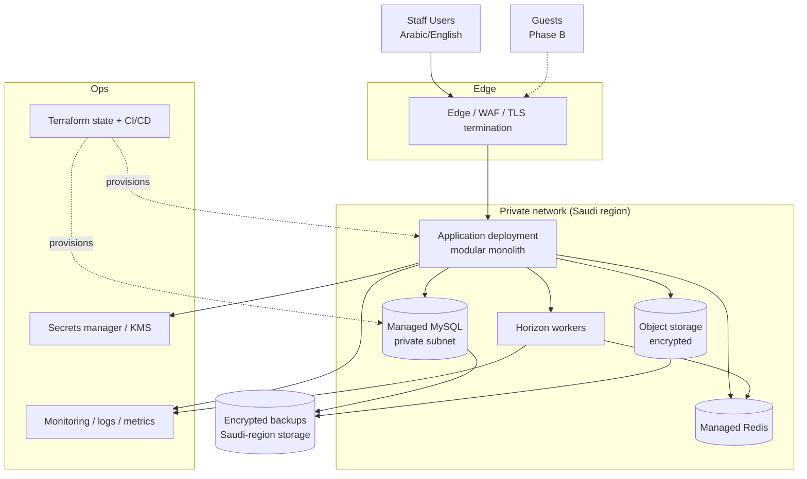

# Zafer Al-Asriya v1.0 — Deployment, Operations and Disaster Recovery

| Field | Value |
|---|---|
| Document | `docs/DEPLOYMENT.md` |
| Version | 0.1 |
| Status | Draft. **No provider is selected. No infrastructure exists. Nothing is deployed.** |
| Operations Owner | **`TBD` (`C-10`)** |
| Related | `D-007`, `ADR-0013`, `ADR-0020`, `ADR-0018`, `B-03`, `C-01` |

---

## 1. Current state, stated plainly

There is **no deployment**. There is no infrastructure, no environment, no pipeline, no monitoring, no backup, and no runbook. This document specifies what must exist.

**`B-03` — no cloud provider is selected. `C-01` — RPO and RTO are undefined.** Every concrete resource in this document is therefore written provider-neutrally, with the provider-specific detail recorded as `UNKNOWN` rather than filled with a plausible guess.

## 2. Topology

| Component | Decision | Status |
|---|---|---|
| Application | One deployment of the modular monolith | Specified |
| Database | Managed MySQL 8 InnoDB, **private subnet, no public endpoint** | `B-03` |
| Cache/queue | Managed Redis + Horizon | `B-03` |
| Object storage | Encrypted | `B-03` |
| Workers | Horizon, same codebase, separate process | Specified |
| Orchestrator | **None.** No Kubernetes | Decided (`D-007`) |
| Multi-cloud / active-active | **None** | Decided (`D-007`) |

## 3. Environments

| Environment | Purpose | Data | Infrastructure |
|---|---|---|---|
| Local / development | Development | **Synthetic only** | May be low cost |
| Staging / UAT | Integration, UAT, performance | **Synthetic only** | Provider-dependent |
| Production | Operations | Real guest personal data | **Saudi region, managed services** |

**No environment other than production may contain real guest personal data** (`D-007`, `PRI-008`). This is written as "no real guest data outside production" rather than "no non-production environment" precisely so that development and staging may use cheaper infrastructure — which is the explicit permission in `D-007`.

Production guest personal data is hosted in a **Saudi Arabia region where technically available**. The provider's regional service parity is verified in `ADR-0020` gate `G-1` before selection.

## 4. Infrastructure as Code

All infrastructure is reproducible through **Terraform or equivalent**. Nothing is created by hand in a console.

Manual console changes are a specific, named risk: they are invisible to code review, absent from the state, and produce drift that surfaces at the worst time. Drift detection is required.

Modules to be defined: network/subnets · compute · managed MySQL · managed Redis · object storage · backups · secrets and KMS · monitoring and alerting · IAM roles · CI/CD pipeline.

**Provider identity is required to create resources, so infrastructure work is blocked by `B-03`.** The module *structure* can be designed now, which is what keeps the domain buildable in parallel.

## 5. Network and access

| Control | Requirement |
|---|---|
| Public exposure | Application only, behind TLS termination and edge protection |
| Database | **Private subnet, no public endpoint** |
| Redis | Private |
| Administrative access | Bastion or equivalent, with full auditing; no direct public administration |
| Inter-service traffic | Private; encrypted in transit |
| Secrets | Centralized secrets manager; **no production secret in source control**; secret scanning in CI |

The private-subnet database requirement is the single control that prevents the most consequential cloud misconfiguration: an internet-reachable database holding guest identity data and financial records.

## 6. Encryption and keys

| Layer | Requirement |
|---|---|
| In transit | TLS for all external and internal traffic |
| At rest | Databases, object storage, backups |
| Backups | Encrypted, in approved Saudi-region storage where available |
| Key management | Centralized KMS |
| **Identity data** | **A separate key boundary**, so routine access — a backup, a replica, a support query, a misconfigured export — does not yield readable identity fields |

**Key management detail is `TBD` (`H-03`)**: rotation policy, key hierarchy, and who holds decryption authority. The *requirement* for a separate boundary is decided and is a release gate, not hardening.

## 7. Backups

| Aspect | Requirement | Status |
|---|---|---|
| Frequency | Automated | `TBD` (`H-07`) |
| Retention | Documented | **`TBD`** (`H-07`) |
| Encryption | Required | Decided |
| Location | Approved Saudi-region storage | Decided |
| **Restore validation** | **Periodic, rehearsed** | **`TBD`** (`H-07`) |
| Point-in-time restore | Hard gate `G-5` in `ADR-0020` | `B-03` |

**A backup that has never been restored is an assumption, not a backup.** Restore validation is a **release requirement**, not a later improvement, because discovering that a backup is unrestorable during an incident is the worst possible timing.

## 8. Disaster recovery

| Aspect | Value |
|---|---|
| **RPO** | **`TBD` — `C-01`. Must be set before production approval.** |
| **RTO** | **`TBD` — `C-01`.** |
| Failover strategy | **`TBD`** — depends on `B-03` |
| DR environment | Cross-region warm standby **designed, not built** |

**RPO and RTO are deliberately not invented.** A fabricated RPO is worse than an absent one: it is a commitment the system was never designed to meet, made by someone who had not verified the backup capability. They must be **derived from the verified backup, restore, and failover capability** of the selected provider — in that order.

### 8.1 Cross-border constraint on DR

**No automatic replication of guest personal data outside Saudi Arabia may be activated** without a documented PDPL/SDAIA cross-border transfer assessment and organizational/legal approval (`D-007`, `ADR-0013` §5).

Three transfer paths are gated, because each is a way personal data leaves without anyone deciding to send it:

| Path | Gate |
|---|---|
| Cross-region database replication | Default **off** for guest personal data; requires an approved assessment |
| Log/trace/telemetry export to a third-party service | Sub-processor review; no identity data in telemetry in any case |
| Vendor support access, including read-only | Reviewed, documented, audited, explicitly scoped and time-bound |

A standby that cannot legally be activated is worse than no standby, because it invites the belief that disaster recovery is already solved.

## 9. CI/CD

| Stage | Gate | Status |
|---|---|---|
| Static analysis / lint | Fail the build | `H-01` — nothing exists |
| Unit / state machine / contract tests | Fail the build | `H-02` |
| **Concurrency suite** | **Fail the build AND the release** | `H-02` |
| Integration tests (fakes) | Fail the build | `H-02` |
| Security / privacy tests | Fail the build | `H-02` |
| Dependency scanning | Fail the build on high severity | `H-01` |
| **Secret scanning** | **Fail the build absolutely** | `H-01` |
| Migration dry run | Fail the release on a non-backward-compatible migration | `H-01` |
| Performance test | Fail the release on threshold breach | Blocked by `B-05` |
| Manual approval | Required before a production deploy | `H-05` |

Artifacts are promoted between environments rather than rebuilt, so what passes the gate is what is deployed.

## 10. Monitoring and alerting

`Prd_Maker.md` §31. **Stack `TBD` (`H-04`).**

| Signal | Purpose |
|---|---|
| Structured logs with correlation ID | Trace one action end to end — never secrets, card data, or document numbers |
| Request count, latency, errors | Availability and performance |
| Queue depth, retry count | Worker health |
| **Dead-letter depth and age** | Compliance submissions and payments failing silently |
| **Reconciliation backlog** | Financial discrepancies accumulating |
| Integration success rate | Provider health |
| **Unknown-outcome payment count** | The highest-value operational alert — money in limbo |
| Night audit completion per property | Missed business dates |
| Database health, resource saturation | Capacity |
| Backup success and **last successful restore validation** | Recovery readiness |

Every alert requires: **threshold · severity · owner · escalation · runbook** (`Prd_Maker.md` §31). An alert with no runbook is a notification, not a control.

**No threshold value is stated here**, because there is no measured baseline and no running system. Thresholds are set after observation, not invented before it.

## 11. Operational model

**No 24/7 support or incident-escalation model exists (`H-05`).** This is a **real gap**, not a formality: a PMS that cannot stop check-in at 02:00 needs a defined escalation path, and the ZATCA dead-letter queue needs an owner who will act on it. It is not solved by choosing a good cloud provider.

| Item | Status |
|---|---|
| Support hours | `TBD` (`M-05`) |
| On-call / escalation | **`TBD` (`H-05`)** |
| Incident severity model | `TBD` |
| Runbooks per service | `TBD` |
| Dead-letter owner | `TBD` |
| Communication to properties during an outage | `TBD` |

## 12. Cutover and rollout

`D-008`: greenfield. No legacy migration.

| Phase | Activity |
|---|---|
| 1 | Provision infrastructure (blocked by `B-03`) |
| 2 | Initial configuration: organization, 10 properties, room types, physical rooms, staff, roles and property scopes, rate plans, taxes, operational configuration, payment configuration, compliance configuration |
| 3 | **Pre-production rehearsal** in staging with synthetic data |
| 4 | Configuration validation against each property's reality |
| 5 | UAT with real hotel staff |
| 6 | **Production readiness gate** (§13) |
| 7 | **Controlled cutover** — start with pilot properties, not all 10 |
| 8 | Post-go-live monitoring with heightened alerting |
| 9 | Gradual per-property rollout |

**Rollback:** a greenfield cutover rollback is primarily a **configuration and access** rollback. **Schema rollback safety must be assessed per migration** (`Prd_Maker.md` §39, §62), and forward-fix is preferred where a rollback would lose data.

**Critical limit on rollback:** once a night audit has run or a payment has been captured or an invoice issued, that is **not reversible by rollback**. It is corrected by compensating entries and credit/debit notes (`ADR-0009`). This is precisely why the pilot is limited to a small number of properties.

## 13. Release gate matrix

`Prd_Maker.md` §64. A release must not be marked ready until all mandatory gates pass.

| Gate | Required | Owner | Status | Evidence |
|---|---|---|---|---|
| Scope frozen | Yes | PM | **No** — blockers open | `D-002` defined; gates not passed |
| P0 requirements complete | Yes | PM | **No** | `docs/PRD.md` §14, §41 |
| State machines reviewed | Yes | Tech | **Partial** | `docs/STATE-MACHINES.md`; `TBD` policies open |
| Security review | Yes | Security | **No — no owner** | `C-10` |
| Privacy review | Applicable | Privacy/Legal | **No — no owner** | `C-10` |
| Regulatory verification | Applicable | Compliance | **No** | `B-01`, `B-02`, `C-03` |
| API contracts | Yes | Tech | Drafted, unverified | `docs/API-SPEC.md` |
| Acceptance criteria | Yes | QA | **Partial** | `docs/PRD.md` §35; no owner |
| **P0 tests pass** | Yes | QA | **No — no code, no harness** | `H-02` |
| **Performance test** | Applicable | Tech | **No** | `B-05` |
| **DR test** | Required | Ops | **No** | `B-03`, `C-01` |
| Migration rehearsal | N/A | — | **N/A** | `D-008` |
| Rollback plan | Yes | Release | Drafted | §12 |
| Monitoring | Yes | Ops | **No** | `H-04` |
| Runbook | Yes | Ops | **No** | `H-05` |

**Three gates are additionally mandated by this project's own decisions and are not in the standard matrix:**

| Additional gate | Source | Why |
|---|---|---|
| **Concurrency suite green, with removal tests demonstrated** | `D-006`, `ADR-0008` | It is the only evidence for the double-booking guarantee |
| **ZATCA submission path tested with reconciliation and DLQ** | `D-003`, `ADR-0010` | A regulated obligation is not "integrated" until its failure path is proven |
| **Provider certification where required** | `D-005` | Blocked by `B-04` |

## 14. Blockers for this document's subject

| ID | Blocker | Blocks |
|---|---|---|
| `B-03` | No cloud provider | Everything in §2, §4, §7, §8 |
| `C-01` | RPO / RTO undefined | Production approval |
| `C-10` | No named operations, security, or compliance owner | Every gate that requires an owner |
| `H-03` | Key management design incomplete | Release |
| `H-04` | No observability stack | Release |
| `H-05` | No 24/7 support or escalation model | Release |
| `H-07` | Backup retention and restore-validation cadence unset | Release |
| `B-05` | Operating scale unknown | Performance targets and capacity |

**Nothing in this document may be executed until `B-03` is resolved**, because no provider has been chosen and no resource can be created. The specifications here are what will be executed once it is.
